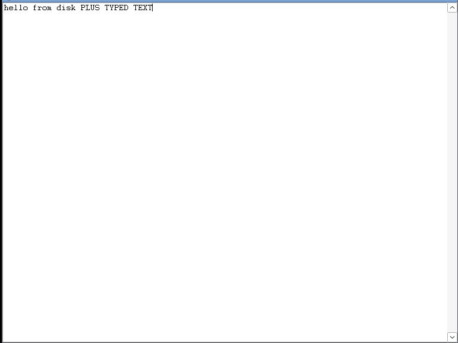

# tinypad.exe — a notepad in 921 bytes

A usable single-window Win32 text editor, hand-crafted in FASM, weighing
**921 bytes** — 45% of the 2048-byte budget, *including* load-on-launch,
Ctrl+S save, and a font fix.



## Usage

```
tinypad.exe [file]
```

- If `file` is given (quoted paths with spaces work), it is loaded on launch
  and **Ctrl+S** writes the buffer back to it.
- With no argument, Ctrl+S writes to `tinypad.txt` in the current directory.
- Word wrap is on, vertical scrollbar, Fixedsys font (the original Notepad
  look). Ctrl+C/V/X/Z work — they're built into the EDIT control.
- Closing the window (or Alt+F4) exits cleanly.

## Build

```
sh build.sh        # fasm tinypad.asm tinypad.exe + size gate
```

Requires [FASM](https://flatassembler.net/) (`apt install fasm`). CI builds
every push, fails if the binary hits 2048 bytes, and verifies the committed
`tinypad.exe` matches the source.

## Where the bytes go

| region | bytes | notes |
|---|---|---|
| DOS+PE+optional+section headers | 180 | fully overlapped, see below |
| code | 340 | cmdline parse, window, load, pump, save |
| import tables & names | 401 | 14 functions across 3 DLLs |
| **total** | **921** | |

## How it's small

**One window, zero window classes.** Instead of RegisterClass + wndproc +
child EDIT + WM_SIZE/MoveWindow plumbing, the EDIT control itself *is* the
top-level window (`CreateWindowExA("EDIT", …, WS_OVERLAPPEDWINDOW|…)`).
EDIT forwards what it doesn't handle to DefWindowProc, so close/resize/paint
all just work. This deletes `RegisterClassA`, `DefWindowProcA`,
`ShowWindow`, `MoveWindow`, `PostQuitMessage` and the entire window
procedure from the budget — the single biggest saving over the spec's
sketch.

**Exit without WM_QUIT.** The message pump filters `GetMessageA` on our
hwnd. Once the window is destroyed, that hwnd is invalid and `GetMessageA`
returns −1; `jle` falls out of the loop into `ExitProcess`.

**Overlapped headers (the classic TinyPE layout).** The file is a PE32 in
low-alignment mode (`SectionAlignment = FileAlignment = 4`), so the image
is mapped as-is and file offsets are RVAs. `e_lfanew = 4` puts the PE
header inside the DOS header, which makes the dword at offset 0x3C do
double duty: it is simultaneously `e_lfanew` (4) and `SectionAlignment`
(4). `NumberOfRvaAndSizes` is truncated to 2 (export + import), shaving 14
unused data directories.

**Header fields as data.** The loader ignores the COFF
timestamp/symbol-table fields — those 12 bytes hold the default save path
`"tinypad.txt\0"`. The 8-byte section Name field holds the window class
`"EDIT\0"`.

**Old-style imports.** `OriginalFirstThunk = 0`, so one thunk array per
DLL serves as both lookup table and IAT.

**The text buffer is free.** 64 KiB on the stack; `SizeOfStackCommit =
0x20000` pre-commits it, so no guard-page probe code and no `.bss`.

**Save/load with no scratch memory.** The file handle is pushed once and
left on the stack across `ReadFile`/`WriteFile` so the same push is
consumed later as `CloseHandle`'s argument.

## Deviations from the spec (spec said better ideas win)

- **`TranslateMessage` is imported.** The spec said to skip it, but without
  it `WM_KEYDOWN` never becomes `WM_CHAR` and you cannot type — fatal for a
  notepad. It also pays for itself: Ctrl+S arrives as `WM_CHAR`/0x13, so the
  save hotkey is a 2-instruction check in the pump with no `GetKeyState`.
- **Dropped:** `RegisterClassA`, `DefWindowProcA`, `ShowWindow`
  (`WS_VISIBLE` at creation), `MoveWindow` (no child to resize),
  `PostQuitMessage` (invalid-hwnd exit instead).
- **Save mechanism (was left open):** argv[1] writeback, with
  hotkey-to-fixed-path (`tinypad.txt`) as the no-argument fallback — the two
  cheapest candidates turned out to be affordable together.
- **Bonus fit in budget:** load-on-launch, quoted-path handling,
  `WM_SETFONT` with `SYSTEM_FIXED_FONT` via gdi32, `EM_SETLIMITTEXT` to
  64 K.

### Answers to the open questions

- *Load-on-launch from argv[1]?* Yes — cost ~90 bytes, in budget.
- *UI chrome?* Standard overlapped-window frame. Quirk: a top-level EDIT's
  "window text" is its buffer, so the caption lazily mirrors what you type.
- *Is <1 KB the flex target?* Achieved **with** save and load. A sub-768-byte
  build is reachable by dropping gdi32 (font), `EM_SETLIMITTEXT`, and
  load-on-launch.

## Verified behaviour

Tested end-to-end under Wine 9.0 (32-bit prefix, Xvfb + openbox + xdotool):

- launches, creates the editor window, Fixedsys font applied
- `tinypad.exe seed.txt` shows the file's contents on launch
- typing works; Ctrl+S rewrites the file (`hello from disk PLUS TYPED TEXT`
  round-tripped)
- quoted path with spaces (`tinypad.exe "my notes.txt"`) loads and saves
- no argument: Ctrl+S creates `tinypad.txt`
- window close / Alt+F4 exits the process cleanly

Wine's loader is more forgiving than Windows', but this exact layout
(e_lfanew=4 overlap, low-alignment single section, old-style imports) is
the well-documented TinyPE construction that loads on real Windows
XP → 11 (32-bit PEs run under WoW64 on x64). A smoke test on real Windows
is still the honest next step.

## Known limits (byte-budget trade-offs)

- 64 KiB text cap; saves clip at 0xFFF0 bytes.
- Files need CRLF line endings — bare-LF files render as one line with
  boxes (classic EDIT behaviour, same as pre-2018 real Notepad).
- No dirty-buffer prompt on close, no Save As, no encoding handling (ANSI).
- Save feedback is silent (the write just happens).
