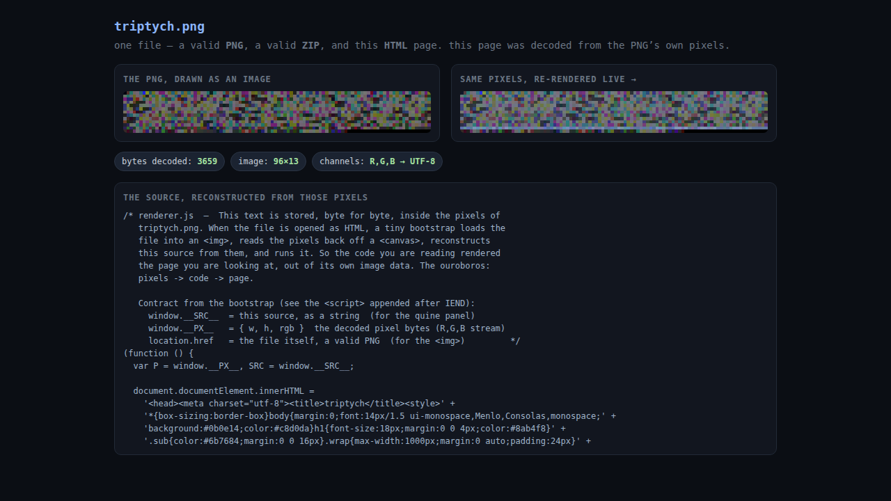

# triptych.png — one file, three formats, and it renders itself

`triptych.png` is a single byte stream that is **all three of** a valid PNG,
a valid ZIP, and a valid HTML page — and when you open the HTML, the page is
decoded from the PNG's own pixels. The JavaScript that draws the page *is*
the image.



## The three facets (same bytes each time)

```sh
file triptych.png          # => PNG image data, 96 x 13, 8-bit/color RGB
unzip -l triptych.png      # => renderer.js, README.md
python3 -m http.server &   # then open the HTML facet, below
```

- **PNG** — open it in any image viewer; you'll see colored noise. That
  noise is the source code of `renderer.js`, one byte per colour channel.
- **ZIP** — `unzip triptych.png` extracts `renderer.js` (the readable
  original) and a short note.
- **HTML** — copy it to an `.html` name and load it over `http://` (see
  below). A bootstrap `<script>` loads the file back into an ``, reads
  the pixels off a `<canvas>`, reconstructs `renderer.js` from them, and
  runs it — and that code renders the page in the screenshot above.

## See the self-decode

```sh
cp triptych.png triptych.html
python3 -m http.server 8000
# open http://localhost:8000/triptych.html
```

It must be **http://**, not a `file://` double-click: browsers taint a
canvas that reads an image from a `file://` origin, which blocks the
pixel read. Over http the file is same-origin with itself and the read is
allowed. (The copy to `.html` only changes the served Content-Type; the
bytes are identical to `triptych.png`.)

## Why the ordering works

```
[ PNG ]  signature + IHDR + IDAT(pixels = renderer.js bytes) + IEND
[ HTML ] <script> bootstrap: load self as , read pixels, eval them
[ ZIP ]  local headers + data + central directory + EOCD
```

Three parsers, three directions, no collision:

- **PNG** is read front-to-back and stops at `IEND`; everything after is
  ignored.
- **ZIP** is read back-to-front — readers locate the End Of Central
  Directory record at the tail, so the archive can live after the PNG. The
  central-directory offsets are written with the PNG+HTML prefix length
  added in, exactly like a self-extracting archive, so `unzip` resolves
  every entry.
- **HTML** parsers ignore the binary they can't tokenize and just run the
  `<script>`, which rebuilds the whole document.

## The self-decoding loop

The pixels round-trip losslessly because the PNG is opaque RGB (colour type
2). Canvas `getImageData` premultiplies alpha, which would corrupt data in
an RGBA image — with no alpha channel, R/G/B come back byte-exact. So:

1. store `renderer.js` as pixel bytes: `[4-byte length][js bytes][zero pad]`,
   laid out R,G,B across the image;
2. at runtime the bootstrap draws the image to a canvas, reads the RGB back,
   takes the length header then that many bytes, UTF-8 decodes them to the
   source, and `eval`s it;
3. the decoded `renderer.js` rebuilds the page — showing the PNG, the same
   pixels re-rendered live on a canvas, and its own source reconstructed
   from those pixels. **pixels → code → page.**

## Build & verify

```sh
python3 build_polyglot.py   # encodes renderer.js into pixels, emits triptych.png
python3 verify.py           # checks PNG + ZIP + pixel round-trip
```

`verify.py` confirms the PNG decodes, the ZIP CRCs pass, and the pixels
reconstruct `renderer.js` byte-for-byte — the same read the browser does at
runtime. Requires Pillow (`pip install pillow`) and `unzip`.

## Honest limits

- The HTML facet needs an `http://` origin (canvas/file:// taint), or
  Chrome launched with `--allow-file-access-from-files`.
- The visible image is intentional noise — the point is that the noise *is*
  the code, not that it's a picture of something.
- Verified in Chromium (Playwright, headless). Firefox/Safari use the same
  canvas semantics and should behave identically; a manual check on each is
  the honest next step.
