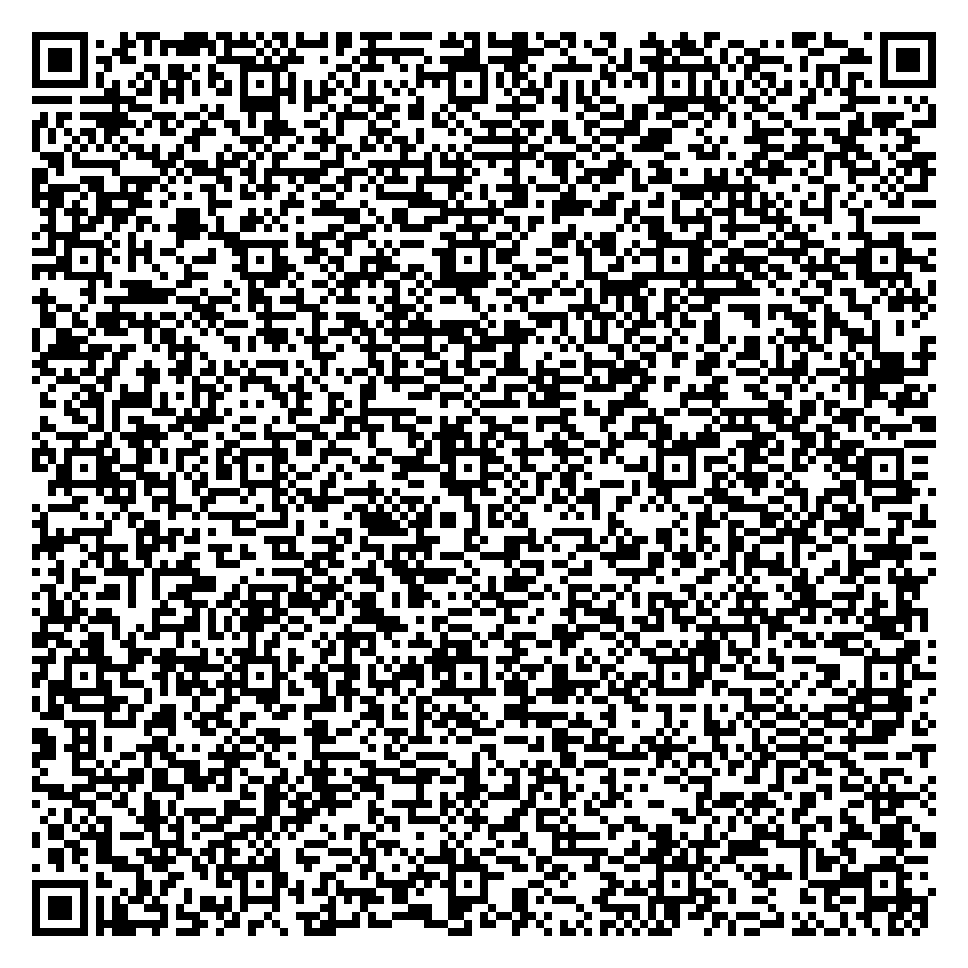
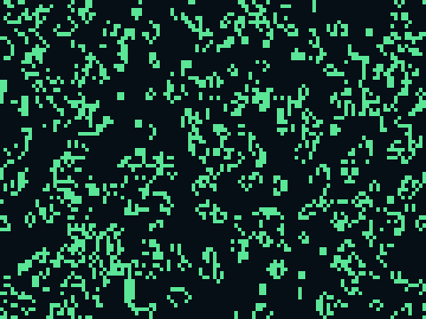

# QR challenges — three takes on "a program in a QR"

Three QR codes, because the honest answer to "can a QR run a real program on
a phone?" has three layers. The headline is `fragment.qr.png`: a genuine
program, carried inside the QR, that runs on **any** phone.

| | scan result | runs on a stock phone? | offline? |
|---|---|---|---|
| **`fragment.qr.png`** | runs a **Game of Life** | ✅ any phone | needs network once |
| **`life.qr.png`** | runs a **Game of Life** | ⚠️ desktop/Firefox only | ✅ fully |
| **`program.qr.png`** | offers **Add Contact** (vCard) | ✅ any phone | ✅ fully |

---

## `fragment.qr.png` — a real program, in the QR, on any phone

<p>
  
  
</p>

**Scan the left code** (or open [`fragment.url.txt`](fragment.url.txt)); the
right image is what you get. The program (a Conway's Game of Life) travels
**inside this QR**, and it runs on any phone. The trick is to stop fighting the browser and borrow a plain,
permanent web standard: **the URL fragment.**

```
https://rawcdn.githack.com/…/run.html#<the entire Game of Life>
```

- The QR is an ordinary **https** URL, which every phone opens without
  complaint — no `data:` URL, so no `about:blank#blocked`.
- The whole program rides in the **`#fragment`**. By the URL spec the
  fragment is **never sent to the server** — it stays entirely on your
  device. The server only ever sees `GET /run.html`.
- [`run.html`](run.html) is a fixed, generic ~30-line stub: it reads the
  fragment and writes it back out as the document, so the QR you scanned
  *becomes* the program. Written once, it carries any program forever.

So the program genuinely lives in the code you scan; the "server" is a
content-free bootstrap. **The only cost is that the stub must be reachable
over https** — that's the irreducible price of the mobile security model
(you trade "fully offline" to buy "runs on any phone"). It's served straight
from this repo via [raw.githack](https://raw.githack.com), pinned to an
immutable commit SHA so it can't change or rot.

**Try it:** scan it, or open [`fragment.url.txt`](fragment.url.txt) in any
browser. It works on desktop and mobile, Chrome and Safari alike.

## `life.qr.png` — the whole program, no server at all


The purist version: the program is a `data:text/html,...` URL, so there is
**no network dependency whatsoever** — but modern *mobile* browsers block
top-level navigation to `data:` URLs (`about:blank#blocked`), so it only runs
where they're allowed: desktop **Firefox**, some scanner webviews, or by
opening [`life.html`](life.html) directly. This is the trade the fragment QR
buys its way out of.

## `program.qr.png` — the reliable non-program


A **vCard**. Not a program, but the one payload every phone acts on with zero
caveats: scan it and it offers to create a contact for tinypad.exe. Kept as
the "works no matter what" baseline.

## Build & verify

```sh
python3 build_fragment_qr.py   # -> fragment.qr.png  (https + fragment)
python3 build_life_qr.py       # -> life.qr.png      (data: URL)
python3 build_qr.py            # -> program.qr.png   (vCard)
python3 verify.py              # decode & validate all three with zbar
```

`verify.py` decodes each QR the way a phone's scanner does and confirms the
fragment QR carries the exact program, points at the https runner, and
round-trips byte-for-byte. Verified end to end in two independent halves that
compose deterministically:

- `run.html` served from rawcdn returns **HTTP 200, `text/html`**,
  byte-identical to this repo's copy (a phone receives the runner as HTML);
- loading that exact `run.html` with this exact fragment runs the Game of
  Life — **~2000 live cells, evolving, no errors** (the `fragment.preview.png`
  above).

Requires `qrcode` (`pip install qrcode`), Pillow, and `zbar-tools`.

### Regenerating the runner

If you change `run.html`, its content hash changes, so re-pin the QR:

1. commit `run.html`, note the new commit SHA,
2. set `RUNNER_URL`'s SHA in `build_fragment_qr.py` to it,
3. rerun `build_fragment_qr.py` and commit the new QR.

The repo must stay public for raw.githack to serve the runner.

## Files

| file | what it is |
|---|---|
| `fragment.qr.png` | **the headline** — program in the fragment, runs anywhere |
| `fragment.url.txt` | the exact https+fragment URL it encodes |
| `fragment.preview.png` | that program running from the runner |
| `run.html` | the generic hosted fragment runner |
| `build_fragment_qr.py` | builds the fragment QR |
| `life.qr.png` / `life.url.txt` | the pure `data:` URL variant |
| `life.html` | the readable Game of Life (feeds both program QRs) |
| `build_life_qr.py` | builds the `data:` URL QR |
| `program.qr.png` / `program.payload.txt` | the vCard variant |
| `build_qr.py` | builds the vCard QR |
| `verify.py` | decodes + validates all three |
