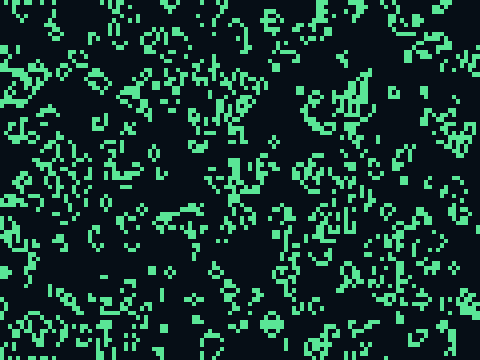

# QR challenges — two takes on "a program in a QR"

Two QR codes here, kept side by side because they answer the challenge in
two honestly-different ways.

| | scan result | works on a stock phone? |
|---|---|---|
| **`program.qr.png`** (vCard) | offers **Add Contact** | ✅ any phone, offline |
| **`life.qr.png`** (data: URL) | runs a **Game of Life** | ⚠️ only where `data:` URLs are allowed |

---

## `program.qr.png` — the QR the phone acts on


Point any phone camera at it and it *does something* offline, no app: it
offers to **create a fully populated contact** — name, org, title, email,
url, and a note explaining itself. It's a vCard, the structured payload iOS
Camera, Android, and Google Lens all recognise and act on.

A standard vCard 3.0 (CRLF line endings, per spec), 337 bytes → a version-14
(73×73) QR at error-correction **M**, so it scans crisply off a screen or a
modest print.

```
BEGIN:VCARD
VERSION:3.0
N:exe;tinypad;;;
FN:tinypad.exe
ORG:TinyNotepad
TITLE:A usable Win32 notepad in 921 bytes
EMAIL;TYPE=INTERNET:hello@example.com
URL:https://github.com/jameseedi/tinynotepad
NOTE:You created this contact by pointing a camera at a QR code — …
END:VCARD
```

## `life.qr.png` — the whole program *inside* the QR



This QR's payload **is** an entire program: a minified, self-contained
Conway's Game of Life ([`life.html`](life.html)) encoded as a
`data:text/html,...` URL. Where the data URL is allowed to open, scanning it
launches a live, full-screen simulation — no network, nothing installed. The
screenshot above is that program, decoded straight from the QR and run.

692 bytes of program → a version-18 (89×89) QR at ECC-L. The Game of Life
uses `%` for its toroidal wraparound; `%` is structural in a URL, so it's
encoded as `%25` and the browser decodes it back before running.

**The catch — and why the vCard exists too:** modern *mobile* browsers block
top-level navigation to `data:` URLs as an anti-phishing measure (Chrome
60+; you get `about:blank#blocked`). A cold scan on a stock phone therefore
won't launch it, and with no server there's no first-party origin to open it
from — running arbitrary code off a phone scan is exactly what browsers
refuse. So `life.qr.png` runs where a `data:` URL *is* permitted:

- desktop **Firefox** (open the decoded URL directly),
- QR apps that render results in their own webview,
- or just open [`life.html`](life.html) in any browser.

## Build & verify

```sh
python3 build_qr.py          # -> program.qr.png  (vCard)
python3 build_life_qr.py     # -> life.qr.png     (data: URL Game of Life)
python3 verify.py            # decode both with zbar; validate the vCard
zbarimg --raw program.qr.png # see exactly what a scanner reads
```

`verify.py` decodes each QR the way a phone's scanner does: it confirms the
vCard is exact and well-formed, and that `life.qr.png` round-trips to the
`data:` URL byte-for-byte. Running the Game of Life needs a browser (verified
in Chromium, which permits `data:` navigation: ~1900 live cells, evolving,
no errors — the `life.preview.png` above). Requires `qrcode`
(`pip install qrcode`), Pillow, and `zbar-tools`.

## Files

| file | what it is |
|---|---|
| `program.qr.png` | the vCard QR — acts on any phone |
| `program.payload.txt` | the exact vCard it encodes |
| `build_qr.py` | builds the vCard QR |
| `life.qr.png` | the Game-of-Life-as-data-URL QR |
| `life.url.txt` | the exact `data:` URL it encodes |
| `life.preview.png` | that program running, decoded from the QR |
| `life.html` | the readable Game of Life source (feeds `life.qr.png`) |
| `build_life_qr.py` | minifies `life.html` and builds `life.qr.png` |
| `verify.py` | decodes + validates both QRs |
