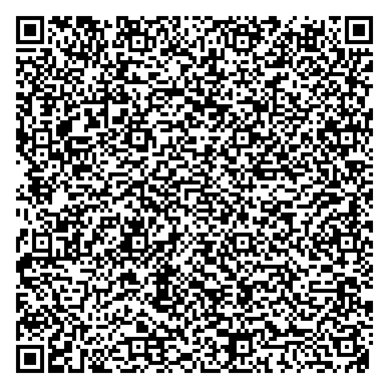
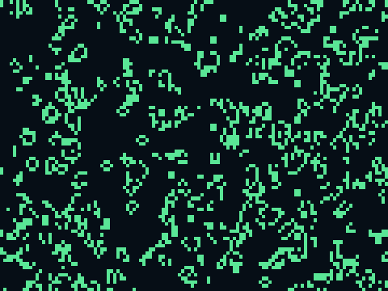

# program.qr.png — a QR code that *is* a program

Scan this QR with a phone and it doesn't open a website — it **runs a
program**: Conway's Game of Life, evolving live and full-screen, tap to
reseed. No network, nothing installed. The whole app is encoded in the code.

 

## How it works

The QR encodes a `data:text/html,...` URL whose body is a minified,
self-contained Game of Life (`life.html`). A QR scanner that opens data URLs
hands it to the browser, which decodes and runs it on the spot. 692 bytes of
program → a version-18 (89×89) QR at error-correction level L.

```
data:text/html,<canvas id=c></canvas><style>…</style><script>…Game of Life…</script>
```

The program uses `%` for its toroidal wraparound (modulo), and `%` is
structural in a URL, so the builder encodes it as `%25`; the browser decodes
it back to `%` before running. That's the only transformation — everything
else is verbatim, which keeps the QR small.

## Try it

- **Scan it** with a phone. Android camera / Google Lens and most scanner
  apps open data URLs directly. **iOS Camera blocks `data:` URLs** — use a
  scanner app that shows the decoded text, or just open `life.html` in a
  browser to see the same program.
- Display or print the QR reasonably large (it's version 18; give it screen
  space and hold steady). The image is rendered at 8 px/module with a quiet
  zone so it scans off a monitor.

## Build & verify

```sh
python3 build_qr.py                       # minify life.html -> data URL -> QR
zbarimg --raw program.qr.png              # decode it back (proxy for a phone)
```

`program.url.txt` is the exact URL encoded, so you can diff it against what a
scanner reads. Verified end-to-end with Playwright: the scanned URL was
decoded with `zbar`, opened in Chromium, and the simulation ran (~1950 live
cells, evolving frame to frame, no errors) — that's the `preview.png` above.

Requires `qrcode` (`pip install qrcode`), `zbar-tools` for `zbarimg`, and
Pillow.

## Files

| file | what it is |
|---|---|
| `life.html` | the readable program (what gets minified) |
| `build_qr.py` | minifies it, builds the data URL, renders the QR |
| `program.qr.png` | the scannable QR — the deliverable |
| `program.url.txt` | the exact URL the QR encodes |
| `preview.png` | the program running, launched from the scanned QR |
